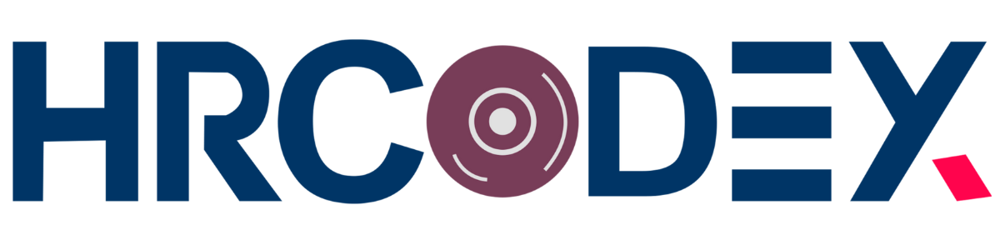

 

## About Laravel

Laravel is a web application framework with expressive, elegant syntax. We believe development must be an enjoyable and creative experience to be truly fulfilling. Laravel takes the pain out of development by easing common tasks used in many web projects, such as:

<!-- Oackage Used in this Project Name&Link -->

## Package Used

-   [Image Intervention](https://image.intervention.io/v3).
-   [Breeze](https://laravel.com/docs/11.x/starter-kits).
-   [dompdf](https://github.com/barryvdh/laravel-dompdf).
<!-- Notes  -->

## Learning Laravel

Laravel has the most extensive and modern web application frameworks, making it a breeze to get started with the framework.

As a Company, we strive to create innovative and effective solutions for businesses of all sizes. [HRCODEX LTD](https://hrcodex.com/), where We will building a modern Laravel application from scratch.

## License

Created By HRCODEX LTD. [license](https://hrcodex.com/).
